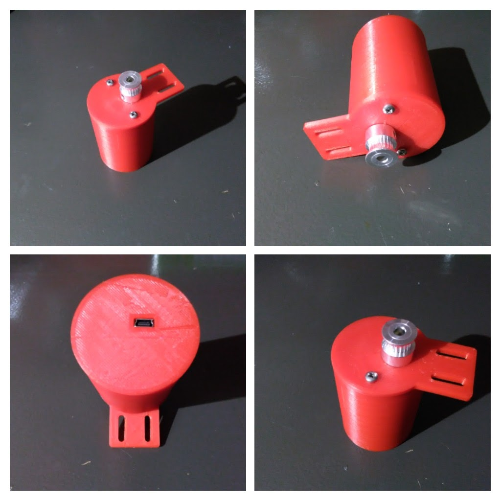
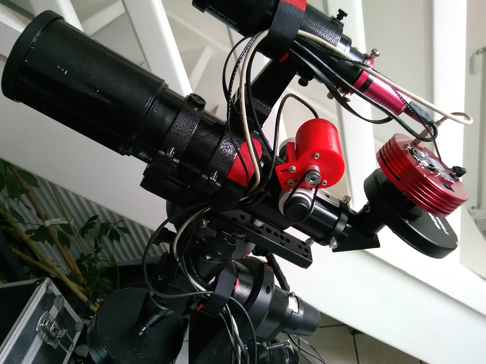
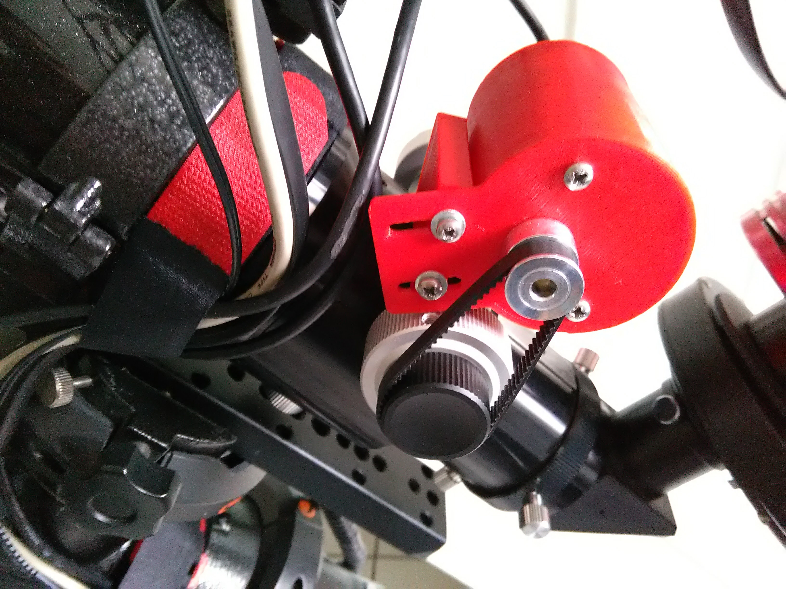

# StellarFocuser

Simple and cheap moonlite focuser protocol implementation for Arduino and stepper motor. 

Tested with Arduino Nano, Uno and cheap [28BYJ-48 stepper motor with driver](https://arduino-info.wikispaces.com/SmallSteppers) and [INDI / Ekos](http://indilib.org).

